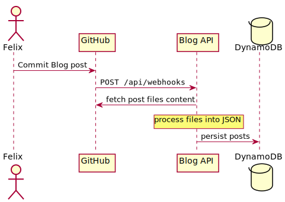
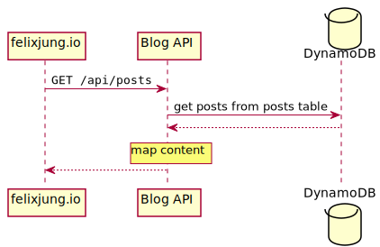

<div align="center">
<h1>blog-headless</h1>
Simple serverless content API built on Vercel serverless functions and DynamoDB.
</div>

### About

I needed something simple and quick to develop to serve
[the content](https://github.com/felixjung/blog-posts) for
[my blog](https://github.com/felixjung/felixjung.io). GitHub is the single
source of truth for the blog's content. Posts are stored as MDX files, exported
from [Ulysses](https://ulysses.app). Metadata is stored together with the posts
in YAML files. Querying the GitHub API for these files when
[fetching routes](https://nextjs.org/docs/basic-features/data-fetching#getstaticpaths-static-generation)
and
[static props](https://nextjs.org/docs/basic-features/data-fetching#getstaticprops-static-generation)
in my Next.js website was not very efficient, especially when trying to paginate
content.



This little project allows me to sync content for the blog to an AWS DynamoDB
table as JSON and then access it from the Next.js website through a small Posts
API. GitHub remains the single source of truth but content can be queried more
efficiently via the API.



The project structure follows Vercel's of keeping serverless request handlers in
`api` folder at the project root and defining routes and route params in the
file names.

```
api
├── index.ts        // Responds with a 404
├── posts
│  ├── [slug].ts    // GET /posts/{slug}
│  └── index.ts     // GET /posts
└── webhooks.ts     // POST /webhooks
```

### Serverless Design Approach

The functions handling requests are composed from middleware functions and a
request handler. The composition approach is heavily inspired by the
[Koa.js](https://koajs.com) web framework.

The original Vercel request handler function
`(req: NowRequest, res: NowResponse): void` is
[mapped](https://github.com/felixjung/blog-headless/tree/main/middleware/context.ts#L20-L43)
to a middleware `async (ctx: Context, next: NextFn): void`. The `Context` type
provides middleware functions with a logger, a request ID, configuration, and
the original request and response objects, `req` and `res`.

Every middleware can `await` the next middleware's return value. As in Koa, this
allows for simple centralized error handling and pre-/post-middleware executing
tasks, such as measuring execution time. Here is an example of the headers
middleware.

```ts
export function withHeaders(headers: { [key: string]: string | number }) {
  return async ({ logger, res }: Context, next: NextFn) => {
    logger.info('adding headers', { headers });

    Object.keys(headers).forEach((key) => {
      res.setHeader(key, headers[key]);
    });

    await next();
  };
}
```

In a handler this middleware is then used as
`export default withContext(withHeaders({ 'x-my-header': 'some-value' }), myHandlerFunction)`.

### Requirements

- A GitHub repository storing content
  [the same way I do](https://github.com/felixjung/blog-posts).
- A Vercel project to run the serverless functions.
- An AWS DynamoDB table to write and read JSON content from.
- Vercel CLI for the development environment.

### Installation

Run `npm install` to install dependencies.

### Development

For development, populate a `.env` file derived from `.env` example and run
`vercel dev`.
